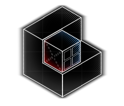
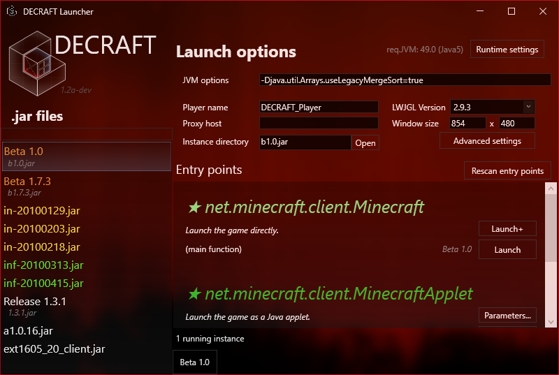

# DECRAFT
Advanced launcher for very old Minecraft.
[Latest releases](https://github.com/counter185/DECRAFT_Launcher/releases)



## About the project
Jar files for very old (preclassic to Indev) versions of Minecraft can be hard to get running. The goal of this project is to make a launcher that can easily make them work without modifying them.

This project's main purpose is **to help preserve these legacy versions**.

#### Target compatibility

All versions up until release 1.5.2 + modifications deriving from them are expected to work. If you find a version that fits this description but does not run, please open an issue.

To run DECRAFT, you will need at least Windows Vista with .NET Framework 4.5.2 installed.

Alternatively, you can run it on Linux through the Wine compatibility layer. With `winetricks` installed, use this command to install all prerequisites:
```sh
winetricks dotnet472 vcrun2012 d3dcompiler_47
```

## Building

To build the project, you will need Visual Studio 2019/2022 with `.NET Desktop Development` tools and `.NET Framework SDK 4.5.2` installed.

## Features

Contributions through PRs are welcome.

- Scanning all classes for entry points
- Launching through `public static void main(String[])`
- Launching `Applet`s through a wrapper with parameters
- Simple old login server emulation
- Custom instance directories